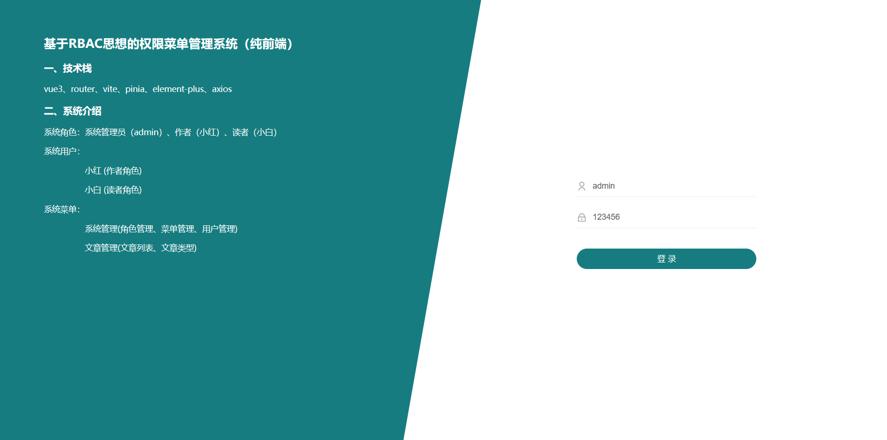

### RBAC-Vue3-Pinia-Vite
这是基于element-plus搭建的布局，基于RBAC设计的权限菜单和权限按钮。
此系统主要展示了前端对于token的处理以及对后端返回的动态权限菜单、权限按钮的处理。

### token逻辑
1. 第一次登录的时候，前端调后端的登陆接口，发送用户名和密码
1. 后端收到请求，验证用户名和密码，验证成功，就给前端返回一个token，并设置失效时间
1. 前端拿到tokn，存储至pinia仓库并持久化至LocalStorage
1. 前端每次跳转路由（即在beforeRoute全局前置守卫中判断），判断token是否存在，不存在就跳转至登录页面，存在则跳转到对应路由页面
1. 在axios请求拦截器中设置token，每次请求接口请求头都携带token
1. 后端判断请求头中有无token，有token，就拿到token并验证token，验证成功就返回数据，验证失败（例如：token过期）就返回401，请求头中没有token也返回401
1. 如果前端拿到状态码为401，就清除token信息并跳转到登录页面

### 前端权限控制的思路：
1. 菜单控制
每次跳转路由前（即在beforeRoute全局前置守卫中处理）判断pinia仓库中是否有权限菜单数据，如果没有就请求菜单权限数据，把菜单权限数据通过addRoutes添加进路由中，同时保存至pinia仓库，如果pinia仓库中存在权限菜单数据，就跳转到对应页面。

1. 界面控制
如果用户没有登录，手动输入url地址，应该阻止并跳转到登录页面，通过路由导航守卫来实现，动态路由可以让不具备权限的界面在路由规则中不存在。

1. 按钮控制
路由规则中可以添加元数据meta，通过路由对象可以得到当前路由规则一级存储在路由规则中的元数据，自定义指令可以实现对按钮的控制

1. 请求和响应控制
请求拦截器和响应拦截器的使用，请求方式约定restful

### 系统展示
1. 系统管理员角色：账号：admin  密码：123456  (管理员角色拥有所有菜单)

2. 作者角色：账号：小红 密码：123456  (作者角色拥有文章菜单权限以及对文章列表、文章类型的新增、修改、删除权限)

3. 读者角色：账号：小白 密码：123456  (读者角色只拥有文章菜单权限，但没有新增、修改、删除的按钮权限)

